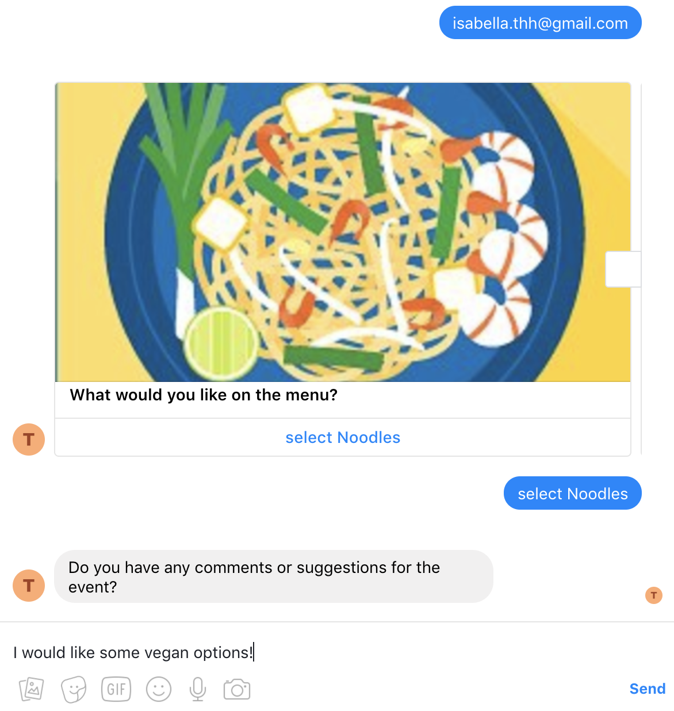

# Typeform to Facebook Messenger Server

A project demonstrating how Typeform forms can be used to create Facebook Messenger Bots. Lots of people, small business owners, NGO field workers, researchers etc. would like to do data collection via Facebook Messenger. Unfortunately, it is not easy to create a Facebook Messenger Bot without some programming knowledge. However, anyone can create a Typeform form. Typeform to Facebook Messenger Server is a starting point for how this can be done.

|                Screen One                |                Screen Two                |
| :--------------------------------------: | :--------------------------------------: |
|  |  |

### Dependencies

```
cd typeform-messenger-server
brew install node
brew cask install ngrok
npm install
```

### Starting Up

```
npm start
ngrok http 3000
```

### Typeform to Facebook Library

The server makes use of the [Typeform To Facebook Messenger](https://www.npmjs.com/package/typeform-to-facebook-messenger) library.

### Facebook Configurations

Ngrok changes the baseUrl on each startup, so you'll have to update your facebook messenger webhooks callback url for your messenger app whenever you restart Ngrok. This can be done via 'edit subscriptions' [on this page](https://developers.facebook.com/apps/1839348233033683/webhooks/)

[Facebook messenger quickstart](https://developers.facebook.com/docs/messenger-platform/getting-started/quick-start)

If the page messenger is not pinging the server try this [SO thread](https://stackoverflow.com/questions/36803570/facebook-messenger-webhook-setup-but-not-triggered?utm_medium=organic&utm_source=google_rich_qa&utm_campaign=google_rich_qa)

Especially, make sure the app is connected to the page, do this with a curl request `curl -X POST "https://graph.facebook.com/v2.6/me/subscribed_apps?access_token=PAGE_ACCESS_TOKEN"`. Looks like this has to be done everytime the server restarts or the Ngrok url is changed.

Make sure in [facebook developer dashboard](https://developers.facebook.com/apps/1839348233033683/messenger/settings/), under webhooks, messages_echos is deselected, otherwise there will be a reciepient ID error when a messages_echos webhook is sent.

Set up a .env file with the following:

```
PAGE_ACCESS_TOKEN=
VERIFY_TOKEN=
FORM_ID=
TYPEFORM_TOKEN=
```

Page access token you get from [facebook developer](https://developers.facebook.com/apps/1839348233033683/messenger/settings/) under token generation. Select a page and a random token will be generated. You then need to subscribe with the curl request above.

Verify token is something you create. Can be anything, 'i love cupcakes' or some uuid, whatever. You set this in the facebook developer dashboard. [Products> webhooks> edit subscription](https://developers.facebook.com/apps/1839348233033683/webhooks/) where you can update the ngrok host and the verify token.

### Way Forward

The server still isn't very useful to non devs with setting up a Facebook bot. Ideally there would be a client where anyone can create their own server, input their access tokens for Typeform and Facebook and set their Facebook webhook urls and deploy with one click. The app is also not scalable at the moment since it write data to json files created on the fly.
